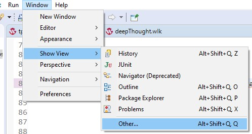
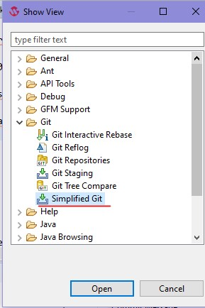
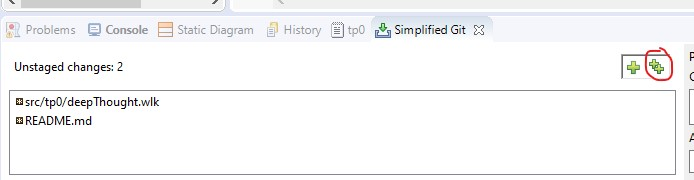
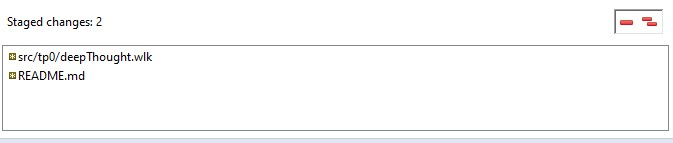
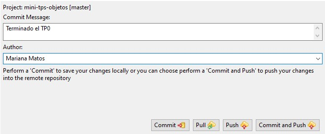
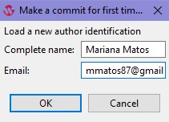

# TP Integrador

Nombre de grupo: 
					Panas Virtuales Comunistas

Integrantes: 
	-Diego Renato Pisconte Castillo
	-Matías Villa
	-Tomás Bavutti
	-Tomás Augusto De Lisio

TP: ...si es juego poner el nombre del juego, si no dejar el [link al enunciado](https://docs.google.com/document/d/1S61v0V8ijICVy5OmhmZeOMklHqFBH_-4HQZFB8d-VLI/edit?usp=sharing)...

# Evaluacion

Recuerden que se va a evaluar no solo que ande si no que:
- Este modelado usando los temas que vimos en la materia.
- Hayan tests.

# Recursos útiles

## Guía de lenguajes

https://docs.google.com/document/d/1oJ-tyQJoBtJh0kFcsV9wSUpgpopjGtoyhJdPUdjFIJQ/edit#heading=h.mdzhan70v9n1

## Documentación de Wollok y Wollok Game

https://www.wollok.org/documentacion/conceptos/

## Apuntes de la materia

http://www.pdep.com.ar/material/apuntes

## Como subir a github los cambios desde la interfaz de Wollok

Podés usar tanto la terminal del sistema operativo (o gitbash) como venías haciendo hasta ahora, o también podés usar un plugin integrado al IDE de Wollok. Para que se muestre usá estas opciones:

   
   
   
   
  > Hay otro plugin similar llamado Git Staging que incluye otras opciones que no consideramos relevantes, y no incluye las opciones de Pull (para integrar los cambios en GitHub que no estén en el repo local) y Push (útil en caso de problemas de conectividad y potenciales conflictos).

1. Luego de seleccionar tu proyecto debería aparecer la lista de archivos modificados. Para agregar todos tus cambios a lo que será tu siguiente commit:

   
   
   Luego de agregarlos, los archivos modificados van a moverse a la lista de abajo (Staged changes), indicando que esos archivos se incluirán en el siguiente commit.
   
   
   
2. Commitear tus cambios con un mensaje representativo y pushearlos al repo remoto:
   
   
   
   > La primera vez que commitees con un autor que no tengas configurado te va a pedir el mail únicamente. Es para una configuración local de git, no es muy relevante.
   >
   > 

Ya sabés que podés subir tu solución tantas veces como quieras. **Es recomendable hacer commits chicos y frecuentes**, en vez de un solo gran commit con todo lo que se pedía resolver.

> En caso de que tengas problemas con el plugin Simplified Git, vale usar el plugin Git Staging junto con otras opciones del IDE que se mencionan en apuntes que están en la página, y también podés usar los comandos de siempre usando gitbash.
