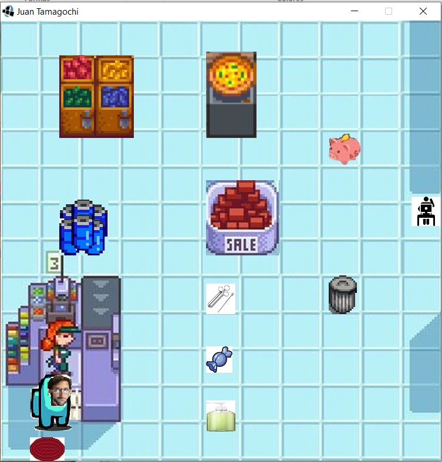

# Juan Tamagochi

Nombre de grupo: 
					Panas Virtuales Comunistas

Integrantes: 

	-Diego Renato Pisconte Castillo
	
	-Matías Villa
	
	-Tomás Bavutti
	
	-Tomás Augusto De Lisio

# Objetivo del Juego

Lograr que Juan sobreviva

# Teclas

Flechas: Se mueve Juan

s: se realiza la accion primaria de un objeto en el mapa

a: se realiza la accion secundaria de un objeto en el mapa (si la tiene)

t: Te muestra lso stats del personaje

j: cambia de trabajo

p: Muestra cuanta plata tiene juan

n: Secreto

M: Ves el interior de la mochila(con numeros se consumen los objetos de la mochila)

## Imagenes del Juego

   
   
   

   
   

